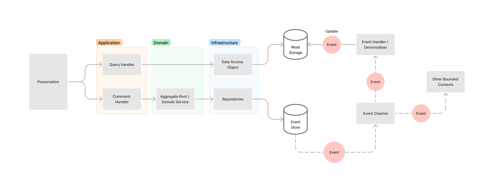

# Greenthumb

## PNPM commands

install a dependency via pnpm global

```bash
    pnpm add amqplib
```

install a dev dependency via pnpm global

```bash
    pnpm add -D @types/amqplib
```

install a dependency on a filtered app

```bash
    pnpm --filter @greenthumb/telemetry add amqplib
```

install a dev dependency on a filtered app

```bash
    pnpm --filter @greenthumb/telemetry add -D @types/amqplib
```

link a package to an app

```bash
    pnpm --filter @greenthumb/telemetry "add" "@greenthumb/delayer@workspace:*"
```

## Microservices

- Telemetry Commands
- Telemetry Queries

### Architecture

This project uses DDD with Onion Architecture as illustrated in below images

Below image illustrates the more detailed architecture



In CQRS & Event Sourcing systems, the main idea is to implement different data models for read and write sides of the application.

The workflow is that the write side sends the `commands` to the `command handlers` through `commandBus` to alter the information. The succeeded commands will then generate resulting `events` which are then stored in the `event store`. Finally, the `event handlers` subscribe to events and generate the denormalised data ready for the query. Please note that the events could also be handled by multiple event handlers. Some of them may handle notification tasks.

The only source of truth of Event Sourcing systems is the `event store` while the data in the read store is simply a derivative of the events generated from the write side. This means we can use totally different data structure between the read and the write sides and we can replay the events from the event store from the whenever we want the regenerate the denormalised data in whatever shapes we want.

In this example, we use `MongoDB` as an event store and `Redis` as the read store.

The commands are sent by the frontend to the `commandBus` which then selects appropriate `command handlers` for the commands. The command handlers then prepare the `Aggregate Root` and apply the business logic suitable for them. If the commands succeed, they result in events which will then be sent to the `eventBus` to the `event handlers`. In this example, the eventBus is implemented using `Apache Kafka`.

To read more about CQRS and Event Sourcing. Please check [this link](https://docs.microsoft.com/en-us/azure/architecture/patterns/cqrs)

## Technologies

- Node.js
- TypeScript
- MongoDB with MongoDB native driver as an event store - (mongodb package on NPM)
- InversifyJS as an IoC container
- Express (via Inversify Express Utils) as an API - framework
- Redis as a read store for telemetry query microservice
- Apache Kafka as a message broker / event bus

## Components

Below is the list of components in this project

1. **Domain Model** (Aggregate Root)
   Contains the business logic required for the application
2. **Commands**
   The command class which implements `CommandInterface` interface. This reflects the intention of the users to alter the state of the application
3. **CommandHandlers**
   The command processor managed by `CommandBus`. It prepares the Aggregate Root and applies business logic on it.
4. **CommandBus**
   The command management object which receieves incoming commands and select appropriate handlers for them. Please note that in order to use the command handlers. They must be registered to the `CommandBus` first at `entrypoint.ts` file.
5. **Events**
   The resulting objects from describing the changes generated by succeeding commands which are sent through the `EventBus`. This class implements `EventInterface` interface.
6. **Event Store**
   The storage that stores events. This is the only source of truth of the system (The sequence of events generated by the application).
7. **EventBus**
   The bus that contains the events where event handlers subscribe to. In this example, `Apache Kafka` is used to implement this
8. **Event Handlers**
   The event processor. This could be the projector or the denormaliser that generates the data for the read side on the read storage.
